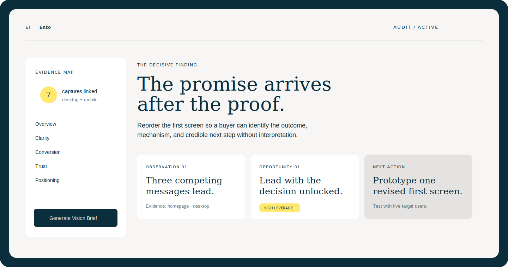

<div align="center">
  

# Borrow world-class judgment. Keep the final say.

Enzo is a founder decision studio. The first release turns product evidence into a defensible decision and an implementation-ready Vision Brief.

[Open Enzo](https://tryenzo.vercel.app) · [Example report](https://tryenzo.vercel.app/reports/demo) · [Architecture](docs/architecture.md) · [Avenir design system](docs/design.md)

</div>

<picture>
  <source media="(prefers-color-scheme: dark)" srcset="docs/assets/enzo-workspace-dark.svg">
  
</picture>

## Why Enzo

Most AI cofounders collapse research, opinion, strategy, and recommendation into one confident answer. Enzo keeps them separate.

Every material finding carries evidence or declares itself as inference. Once the current experience is understood, Enzo asks only the questions that remain unresolved and turns the founder's decision into a Vision Brief that design, product, and engineering can use without translation.

The long-term system adds persistent company memory, routed analytical lenses, structured council disagreement, workrooms, artifacts, and an outcome-aware Decision Ledger. Named minds are optional methodological perspectives, never celebrity role-play or claimed endorsements.

## What ships in this repository

- A polished Next.js workspace using the Avenir editorial design system.
- A remote MCP service with nine versioned tools.
- A portable Agent Skill under 500 lines with progressively disclosed references.
- A repository-local Codex plugin marketplace.
- A shared Zod contract for projects, evidence, captures, findings, interviews, exports, and briefs.
- Safe public-URL capture with redirect revalidation, private-network blocking, response limits, desktop/mobile Playwright captures, and untrusted-content handling.
- Supabase Auth, OAuth 2.1 integration points, private storage, migrations, and ownership-based RLS.
- OpenAI Responses API enrichment with `gpt-5.6-terra` as the configurable default.
- Unit, contract, browser, accessibility-oriented, skill, and plugin validation.

## Experience flow

1. Add a public URL, screenshot, PDF, repository reference, or local codebase fact.
2. Capture observable evidence across relevant states.
3. Diagnose clarity, UX, brand, conversion, positioning, accessibility, trust, and business coherence.
4. Review evidence-linked findings and visible coverage gaps.
5. Resolve remaining decisions through a two-to-four-round adaptive interview.
6. Export the audit and Vision Brief as Markdown, JSON, or a print-ready PDF view.

## Quick start

Requirements: Node.js 20.9+, pnpm 9+, and optional Supabase/OpenAI credentials.

```bash
git clone https://github.com/edenbuilds/enzo.git
cd enzo
cp .env.example .env.local
pnpm install
pnpm dev:web
```

Open [http://localhost:3000](http://localhost:3000). With no credentials, Enzo intentionally starts in deterministic demo mode.

Run the MCP service separately:

```bash
pnpm dev:mcp
curl http://localhost:8787/health
```

To enable browser screenshots:

```bash
pnpm exec playwright install chromium
CAPTURE_ENABLED=true pnpm dev:mcp
```

## Install the Codex plugin

Clone the repository, register its marketplace, and install Enzo:

```bash
codex plugin marketplace add "$(pwd)"
codex plugin add enzo@enzo
```

Start a new Codex task after installation so the skill and MCP tools are discovered.

## Install only the portable skill

Copy the nested skill into your agent’s skill directory:

```bash
cp -R plugins/enzo/skills/enzo ~/.codex/skills/enzo
```

The folder follows the open Agent Skills format and does not depend on Enzo’s MCP service. In other compatible tools, copy it to that tool’s documented skills directory.

Example prompts:

- “Use Enzo to audit this landing page and show me only evidence-backed findings.”
- “Interrogate the positioning of this product before we redesign it.”
- “Audit these screenshots, then run the shortest useful vision interview.”
- “Inspect this repository and produce a codebase-aware Vision Brief.”

## Supabase setup

```bash
npx supabase start
npx supabase db reset
```

Set the public URL and publishable key in `.env.local`; keep the secret key server-side. Enable GitHub sign-in and OAuth 2.1 in the Supabase dashboard, configure the Enzo consent route, and set `SUPABASE_OAUTH_ISSUER` for the remote MCP service.

The initial migration creates private project, evidence, capture, audit, answer, brief, export, and share-link tables. Every exposed table has RLS. The private evidence bucket allows PNG, JPEG, WebP, and PDF files up to 20MB under a user-owned path.

## OpenAI setup

Set `OPENAI_API_KEY` only on the MCP service. `OPENAI_MODEL` defaults to `gpt-5.6-terra`. Captured page content is passed as untrusted data, never as instructions. Without a key, Enzo retains deterministic demo audits for development and CI.

## Validation

```bash
pnpm validate
pnpm test:e2e
```

CI checks formatting, linting, TypeScript, unit tests, builds, browser smoke flows, a clean Supabase migration reset, and both the skill and plugin manifests.

## Security and privacy

- HTTPS targets only; credentials embedded in URLs are rejected.
- DNS results and redirects are checked against loopback, link-local, private, reserved, and multicast ranges.
- Browser subrequests are intercepted and revalidated.
- Projects and evidence are private by default.
- Service-role keys never enter browser bundles.
- Hosted v1 does not log in to third-party products, submit forms, or ingest private hosted repositories.

Read [PRIVACY.md](PRIVACY.md) and [TERMS.md](TERMS.md).

## Current v1 boundaries

The public beta does not include billing, teams, private repository OAuth, authenticated browser sessions, continuous monitoring, or white-label exports. The roadmap includes agency workspaces, scheduled re-audits, experience-drift comparison, Figma/Framer handoff, design-system extraction, and evidence-backed implementation backlogs.

## Contributing

See [CONTRIBUTING.md](CONTRIBUTING.md). Security-sensitive reports should not be filed as public issues; contact the repository owner privately.

## License

[MIT](LICENSE) © 2026 Omkar Sonawane.
