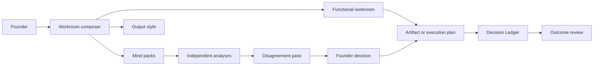

<div align="center">
  

# Enzo finds what matters. You make the call.

Enzo is a founder operating system for choosing how a problem should be challenged, where the work should happen, and how the result should be expressed.

[Open Enzo](https://tryenzo.vercel.app) · [Compose a workroom](https://tryenzo.vercel.app/workrooms/new) · [Browse minds](https://tryenzo.vercel.app/minds) · [Open Forward Deployed Engineering](https://tryenzo.vercel.app/workrooms/forward-deployed-engineering)

</div>

## How Enzo works

Every run combines three founder-controlled choices:

1. **Mind:** Choose a reviewed methodological perspective, or let Enzo recommend a small council.
2. **Workroom:** Choose the business outcome, from product strategy to Forward Deployed Engineering.
3. **Style:** Choose how generated work should look, sound, or behave.

Enzo keeps company evidence, assumptions, disagreements, founder decisions, artifacts, approvals, deployments, and outcomes connected. It never turns a named mind into celebrity role-play or takes the founder’s final choice away.

## What ships

- Ten bounded mind packs with provenance, competence, exclusions, blind spots, cutoffs, and evaluation status.
- Eight primary workrooms for product, design, marketing, sales, engineering, audit, decisions, and outcomes.
- Eight output styles plus marketing and sales approach packs.
- A workroom composer with manual selection, Enzo routing, founder overrides, and reusable contracts.
- Independent first-pass analyses followed by explicit disagreement and Enzo synthesis.
- Approval-gated Forward Deployed Engineering with separate code-change and deployment gates.
- Company memory, evidence claims, editable artifacts, a Decision Ledger, and outcome review.
- A remote MCP service, a repository-local Codex plugin, and portable Agent Skills.
- Supabase persistence with ownership-based Row Level Security and a deterministic public demo.
- The Enzo Broadsheet design system and an original white puppy identity.

## Mind library

The launch catalog includes Steve Jobs, Alex Hormozi, Charlie Munger, Paul Graham, Naval Ravikant, Nassim Taleb, Andrej Karpathy, Richard Feynman, MrBeast, and Rob Pike.

Each entry is a methodological perspective derived from public material. It is not the person, an endorsement, or an official representation. Research-stage minds are visible for inspection but cannot enter production councils until provenance and evaluation gates pass.

## Forward Deployed Engineering

Forward Deployed Engineering is a primary executable workroom:

1. Inspect the repository, environment, architecture, and deployment target.
2. Connect the founder’s business decision to a bounded technical outcome.
3. Produce a technical design, risk assessment, acceptance criteria, verification commands, and rollback plan.
4. Request explicit approval before changing code or consequential state.
5. Implement and verify the approved scope.
6. Request separate approval before deployment.
7. Record the revision, deployment, rollback metadata, success metric, and outcome review date.

The public demo simulates approvals and never changes production state.

## Architecture



The web product is built with Next.js. The MCP service exposes audit, decision, catalog, workroom, approval, and deployment tools. Shared Zod contracts live in `@enzo/audit-core` and `@enzo/decision-core`. Supabase stores private company and workflow state with RLS.

## Quick start

Requirements: Node.js 20.9+ and pnpm 9+.

```bash
git clone https://github.com/edenbuilds/enzo.git
cd enzo
cp .env.example .env.local
pnpm install
pnpm dev:web
```

Open [http://localhost:3000](http://localhost:3000). Without credentials, Enzo starts in deterministic, non-persistent demo mode.

Run the MCP service separately:

```bash
pnpm dev:mcp
curl http://localhost:8787/health
```

## Install the Codex plugin

```bash
codex plugin marketplace add "$(pwd)"
codex plugin add enzo@enzo
```

Start a new Codex task after installation so the skills and MCP tools are discovered.

## Install portable skills

```bash
cp -R plugins/enzo/skills/* ~/.codex/skills/
```

Example prompts:

- “Use `$enzo-core` to compose a workroom for this founder decision.”
- “Use `$product-strategy` to choose what this product should promise first.”
- “Use `$design-brand` to turn this direction into an accessible design system.”
- “Use `$marketing-growth` to create a proof-led launch test.”
- “Use `$sales-offers` to clarify this offer and buyer path.”
- “Use `$forward-deployed-engineering` to scope, verify, and deploy this change through explicit approvals.”

## Supabase and OpenAI

```bash
npx supabase start
npx supabase db reset
```

Set the public Supabase URL and publishable key in `.env.local`. Keep secret keys server-side. Authenticated production fails closed when private persistence is unavailable.

Set `OPENAI_API_KEY` only on the MCP service. `OPENAI_MODEL` defaults to `gpt-5.6-terra`. Without a key, Enzo uses deterministic fixture execution for the public demo and CI.

## Validation

```bash
pnpm validate
pnpm test:e2e
```

Validation covers formatting, linting, TypeScript, unit tests, builds, copy rules, MCP contracts, skills, plugin structure, and browser workflows.

## Security and privacy

- Private company state is owner-scoped.
- Captured content, repositories, and upstream skills are untrusted evidence.
- Named minds include provenance and competence boundaries.
- Independent analyses are persisted before synthesis.
- Code changes and deployments require separate explicit approvals.
- Hosted execution never silently falls back to ephemeral storage.
- The public fixture does not persist founder input or modify production systems.

Read [PRIVACY.md](PRIVACY.md), [TERMS.md](TERMS.md), and [the provenance model](docs/enzo/07-safety-legal-provenance.md).

## Current boundaries

The public demo is deterministic. Private beta requires Supabase credentials and OAuth. Research-stage minds are not production-enabled. V1 does not include billing, teams, marketplace monetization, private repository OAuth, authenticated browser sessions, immersive voice, white-labeling, or unsupervised production execution.

## Contributing

See [CONTRIBUTING.md](CONTRIBUTING.md). Security-sensitive reports should not be filed as public issues.

## License

[MIT](LICENSE) © 2026 Omkar Sonawane.
