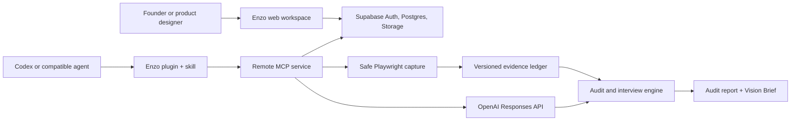

# Architecture

The audit core is deterministic and provider-independent. Model enrichment is optional; without an API key, Enzo runs in demo mode and still validates contracts, interview routing, exports, and plugin behavior.

The hosted service accepts public HTTPS evidence only. URL resolution is checked before every redirect and browser request to block private networks. Authenticated browsing and private hosted-repository ingestion are intentionally outside v1.
