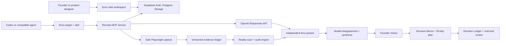

# Architecture

The audit core remains backward compatible. The decision core is provider-independent: fixture execution powers the non-persistent public demo, while hosted execution uses independent Responses API calls and ownership-scoped Supabase repositories. Authenticated production fails closed when private persistence is unavailable.

The hosted service accepts public HTTPS evidence only. URL resolution is checked before every redirect and browser request to block private networks. Authenticated browsing and private hosted-repository ingestion are intentionally outside v1.
