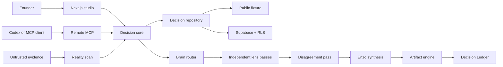

# System architecture

Enzo separates company truth, decision workflow, perspective methodology, and model execution.

The model provider receives four isolated layers: immutable Enzo policy, workflow contract, reviewed lens methodology, and escaped untrusted evidence. No captured instruction can change the first three layers. Each independent lens pass is persisted before peer analyses are visible.

The public demo uses `FixtureDecisionRepository`. Authenticated MCP calls use the caller's JWT with `SupabaseDecisionRepository`; missing hosted persistence fails closed. Existing audit schemas and tools remain backward compatible.
